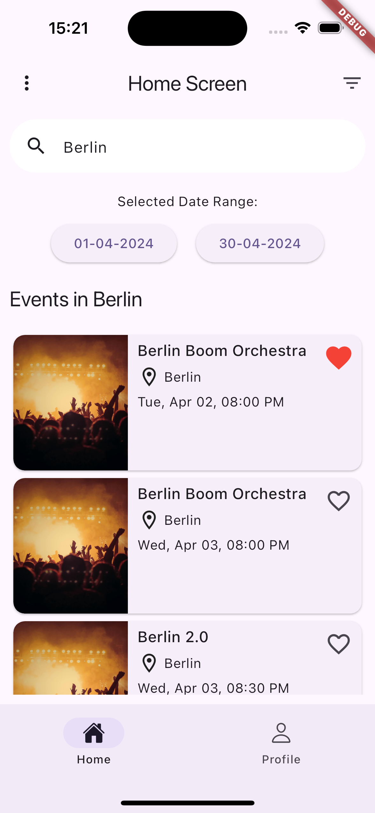

# events_app

Process of creating an app from template and adding packages along the way.

App and packages are compatible with Material3.
Instructions for adding every package I mention can be found in README.md file in each package's repository on Github https://github.com/sequrify-io

### Screen right after creation from template

If we want to add sign up and sign in process, we can easily do so by using nx_firebase_auth package, that uses Firebase UI Auth.

### App screens after adding nx_firebase_auth package

### App screen after adding nx_main_screen package

nx_main_screen package provided me with main screen reusable widget that comes with navigation bar and navigation state provider for managing navigation between tabs, when coming from different views. I also get nx_basic_screen widget which is a reusable widget for screens inside tabs.

Now I want to add some nx_ui widgets like drawer, buttons, cards. I import nx_ui package to use pre-made components.

### App screen after adding nx_ui package

Now I can integrate nx_sequrify package and use Sequrify button inside drawer, to let users know that the app is monitored by Sequrify.

### App screen after adding nx_sequrify package

Now I want to integrate API into my app in order to fetch events in my area. For this I'm using Retrofit, based on example provided in nx_retrofit package. I import nx_retrofit package to project, which automatically provides me with Retrofit library. I'm using PredictHG api.

### Screen after integrating retrofit based on example in nx_retrofit package

Here I fetched events that are happening in Poznań during the nearest weekend.

I want to place my response data inside list view.
I can use widgets from nx_ui package. I'm also integrating nx_image_picker package to use image picker.

I want to add search button from nx_ui, to let user find events happening during nearest weekend, based on the provided location.

### App screen after adding search bar

Now I'll integrate nx_calendar package to be able to select range of dates between which I want to search for events.

### App screen after integrating nx_calendar package

### UI design change

Now I'll add filter modal. For this I'll use chips from nx_tab_bar package.

### App screen after integrating nx_settings package

### App screen after integrating nx_profile package

Adding events to favorite:

### App screens with different color pallette

Template and packages are compatible with color system that comes with Material3.
App UI is automatically adjusted to the used color palette:

